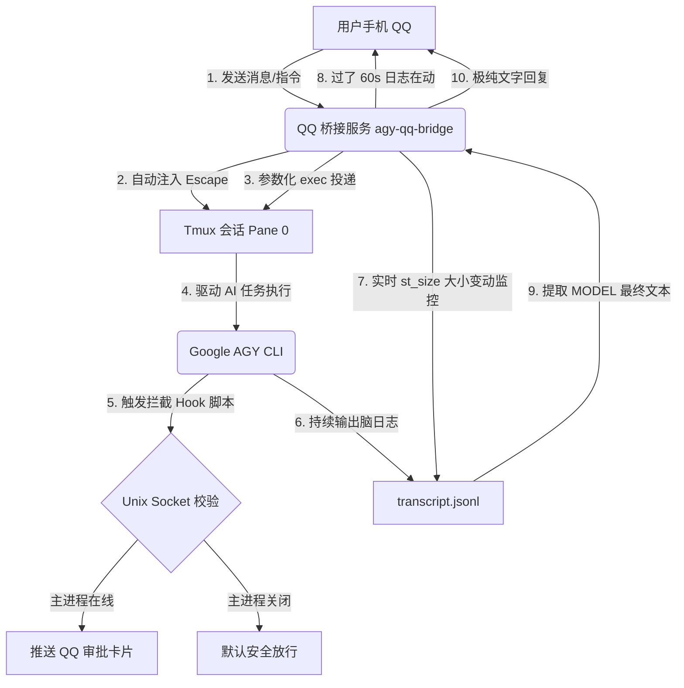

# AGY-QQ-Bridge (Google Antigravity QQ 机器人桥接网关)

🚀 **AGY-QQ-Bridge** 是专为谷歌下一代强大 Agent 终端 **Google Antigravity (AGY)** 研发的轻量级 QQ 机器人双向桥接网关。

本项目通过将 AGY CLI 的 TUI 终端环境与 QQ 开放平台进行打通，使开发者能够直接在手机 QQ 上以对话的形式安全、稳定地调度后台的 AI 编码助手，并享有高阶的进度探测与紧急阻断控制。

---

## 🌟 核心解决痛点

在传统的终端桥接方案中，AGY 自身的 TUI 动态终端特性会给外部程序集成带来极高阻碍。本项目针对以下业界大坑进行了深度优化与彻底解决：

1. **控制字符与乱码污染**
   * **痛点**：TUI 终端（如 Rich 库、文字动画、重绘）会产生海量的 ASCII 颜色代码和屏幕重写控制符，直接截屏会导致发送到 QQ 的消息充斥着大量不可读乱码。
   * **解决**：采用**单向脑日志增量读取技术**，直接监听机器人产生的结构化 `transcript.jsonl`，提取纯净的 `MODEL PLANNER_RESPONSE` 文本，给 QQ 投递纯净、无任何控制符的纯文本聊天。
2. **物理终端焦点被夺与卡死**
   * **痛点**：国内服务器网络环境下，AGY 启动或运行中可能会偶尔弹出谷歌配额弹窗或清理验证弹窗，霸占键盘焦点，导致 QQ 消息注入失败；同时，包含多行或复杂符号的长指令容易在 Shell 嵌套解析中因语法错乱而令后台进程卡死。
   * **解决**：在投递前引入 **`Escape` 键前置投递机制** 强行闭合潜在弹窗；并彻底淘汰 `shell` 拼接，采用底层的**纯参数式（`exec`）消息投递**，保证任何多行代码或特殊字符均能百分之百安全发送且绝不挂起。
3. **黑盒审批的不可控性**
   * **痛点**：AGY CLI 在运行危险命令（写文件、跑 shell 等）时，会在终端弹出交互式确认选项（`Allow/Deny`）。通过分析终端文本进行按键模拟的“物理审批”极不稳定，容易造成假阳性卡死。
   * **解决**：倡导**会话与安全完全解耦**。关闭终端物理 TUI 拦截，将审批权完全托管给底层内置的**工具审批钩子（Tool Hook）**，利用进程状态与 Unix 套接字实现 100% 结构化、防卡死的 QQ 官方卡片白盒审批拦截。

---

## 🛠️ 关键特色机制

* **极简零依赖配置**：脚本内置微型 `.env` 解析器，开箱即用，无需通过 `pip` 安装任何第三方 dotenv 解析库，最大化减少外界环境依赖。
* ** st_size 活跃度探测**：桥接脚本会以毫秒级频率监控脑日志文件的字节大小变化。无需解析复杂的 JSON，若文件大小在变化即判断为“后台正在执行（如运行高危工具）”，若大小静止则判定为“深度思考中”，每隔 60 秒自动在 QQ 窗口向您反馈已耗时与活跃状态。
* **5分钟温和超时（不强杀）**：等待时长满 5 分钟后，脚本自动解除 QQ 端的挂起状态（释放通道接收新消息），但**绝不执行强杀**，让后台的重度编译或大文件下载任务得以安全地在后台继续完成。
* **紧急刹车 `/stop` 豁免穿透**：终止指令排在最优先级，不受“机器人当前正忙”状态的拦截。一旦用户因误操作或语音误识别发出高危指令，只要在 QQ 上发送 `/stop`、`/停止` 或 `/kill`，即可瞬间穿透拦截，向后台终端投递中断信号（`Ctrl+C`）进行紧急复位。

---

## 📐 系统工作流架构



---

## 🚀 部署指南

### 1. 准备环境
* 操作系统：Linux
* 软件依赖：Python 3.10+, tmux, pm2 (推荐)

### 2. 凭据配置
在项目根目录复制配置文件模板：
```bash
cp .env.example .env
```
用编辑器打开 `.env`，填入您的真实开发凭据：
```env
APP_ID=您的QQ机器人AppID
CLIENT_SECRET=您的QQ机器人密钥
MASTER_OPENID=会话所有者(您自己)的OpenID
TMUX_SESSION=0
```

### 3. 运行与保活
推荐使用 PM2 进行进程守护保活：
```bash
pm2 start agy-qq-bridge.py --name "agy-qq-bridge"
```

---

## 💬 常用控制指令

* **直接发送消息**：输入任意自然语言即可与您的 AGY 机器人直接开始对话。
* **`/new` 或 `/reset`**：清空会话，并在后台终端自动为 AGY 开启一个全新的对话上下文。
* **`/stop` 或 `/停止`**：无条件紧急刹车，向后台发送中断信号，中止当前正在运行的任务。