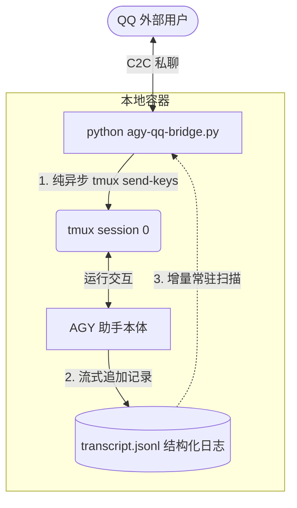

# AGY-QQ-Bridge: 极简 C2C 异步日志增量 QQ 桥接器

AGY-QQ-Bridge 是一个用于将本地常驻运行的 Google Antigravity (AGY) 实例直连到 QQ 个人私聊通道的轻量级桥接系统。

通过采用“去状态机、完全解耦收发、纯异步日志增量监听”的现代化设计，本项目彻底解决了一问一答式同步卡死、时序对不上、以及长耗时任务多次分段回复丢失的痛点。

---

## 🌟 核心架构与优势



*   **输入输出完全解耦**：QQ 消息只管送入终端，后台协程只管监听日志并广播回传。无忙碌锁、无同步超时死锁。
*   **支持“一次输入，多次回复”**：完美契合 AI 助手在执行长耗时任务时分步骤、断断续续地汇报进度的行为特征，保证所有发出的文字 100% 被捕获回传。
*   **自适应重置与热绑定**：在执行 `/new` 切换或重置会话时，监听器会在 0.5 秒内自动绑定新生成的日志文件，并自动定位水位线，杜绝任何历史消息的重复刷屏与多实例逻辑混乱。

---

## 🛠️ 安装与运行

### 1. 准备环境

项目运行依赖 Python 3 和本地安装的 `tmux` 虚拟终端：
```bash
# 安装 Python 异步网络库
pip install aiohttp httpx
```

### 2. 配置文件说明

将项目根目录下的 `.env.example` 复制为 `.env`，并填入相应的参数：
```bash
cp .env.example .env
```

配置项解释：
*   `APP_ID` / `CLIENT_SECRET`：QQ 开放平台申请到的官方机器人应用密钥。
*   `MASTER_OPENID`：您的个人 QQ C2C OpenID，桥接器仅会对该管理员的消息进行安全响应。
*   `TMUX_SESSION`：用于保活 AGY 运行的 tmux 会话名，默认值为 `0`。
*   `BRAIN_DIR`：AGY 的 `brain/` 日志目录，默认会自动定位到 `~/.gemini/antigravity-cli/brain`。
*   `AGY_START_CMD`：重置会话时，用于在终端重新拉起 AGY 的启动指令，默认提供 `--dangerously-skip-permissions` 以进行免人工干预的自动化部署。

### 3. 使用 PM2 进行守护与热启动

推荐使用 Node.js 的进程管理器 `pm2` 来保证桥接服务的持续运行：
```bash
# 启动桥接服务
pm2 start agy-qq-bridge.py --name agy-qq-bridge

# 查看运行状态与实时日志
pm2 status
pm2 logs agy-qq-bridge
```

---

## 💬 交互指令介绍

在 QQ 个人私聊中，您可以向您的机器人发送以下控制指令：

| 指令 | 作用 | 内部实现逻辑 |
| :--- | :--- | :--- |
| **任意文字** | 交互输入 | 发送 Escape 清理终端 TUI 状态 ➔ 通过 tmux 物理键入 ➔ 回车发送给 AGY |
| **`/new`** | 重置会话 | 强杀旧的 tmux 会话 ➔ 新建 tmux 会话 ➔ 自动拉起全新 AGY 进程 ➔ 桥接器 0.5s 内自动热绑定全新日志 |
| **`/stop`** | 强行终止 | 连续向 tmux 发送三次 `Ctrl+C` 物理信号，强制停止当前的执行任务，恢复命令行状态 |